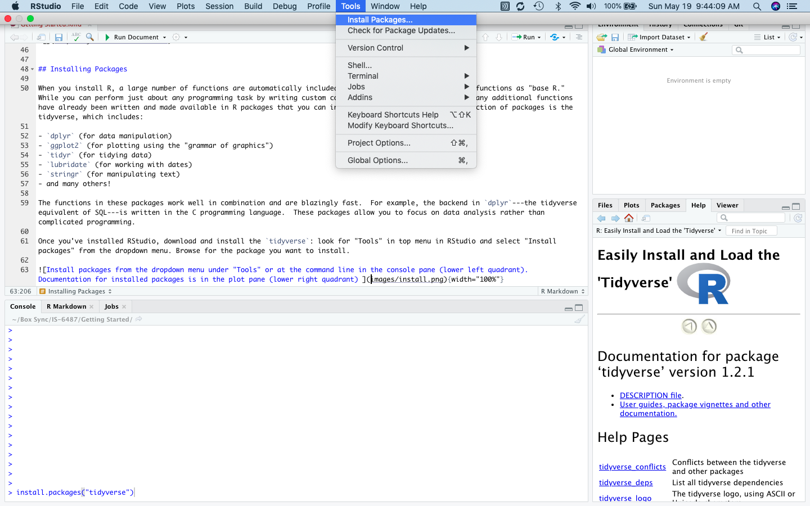
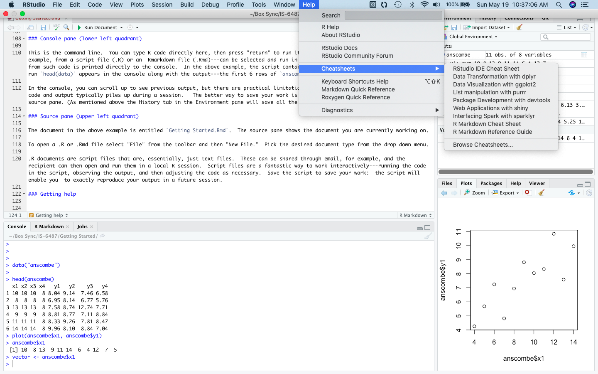

# Getting started with R

```{r, include = F}
library(knitr)
library(vembedr)
```

## tl:dr


This chapter introduces R and Rstudio, explains the difference between them, provides instructions for downloading and installing them on your computer, and offers a quick introduction to the layout and use of RStudio.


## R

R is a free, open source statistical programming language that consists in a set of functions for doing stuff with data: manipulating it, graphing it, and calculating statistics (among other things). Further information on R is available at the [R project](https://www.r-project.org/about.html) page. 

Go to the Comprehensive R Archive Network or [CRAN](https://cran.r-project.org) to download R and install it on your computer. Pick the latest release for your operating system.  Here are instructions:

```{r echo = F}
embed_url("https://vimeo.com/203516510")
```


We will refer to the basic functions included with the version of R that you installed from CRAN as "base R." 

What is a function? In R a function automates a repeated task, like calculating a mean.  You could, of course, calculate a mean by adding up all the values you want to average and then dividing by the number of items.  This is time consuming.  Better to use a function that automatically completes this sequence of steps. In base R the function for calculating a mean is, not surprisingly, `mean()`. (I will use the terms "command" and "function" somewhat interchangeably.)  

There are  a very large number of supplementary packages that extend R's usefulness; these must be downloaded and installed separately.  One of the great things about R is that the development community is extremely active and new packages implementing cutting edge techniques are being added all the time. (As of May 2019 there were over 14,000 packages.)

## RStudio

RStudio is a free [integrated design environment](https://en.wikipedia.org/wiki/Integrated_development_environment) or IDE for R. R can certainly be used by itself (and in fact many people whose workflows predate RStudio prefer to do just that) but the graphical user interface or GUI is extremely minimalistic.  RStudio helps improve productivity by  supplying a much richer GUI that offers menu-driven support for many programming and organizational tasks. An IDE such as RStudio makes it easier to get stuff done. We will be using RStudio extensively in this course. 

Go to [rstudio.com](https://www.rstudio.com) to download the desktop version of RStudio, making sure to pick the free version that is appropriate for your operating system.  Note:  *you must have R installed before you install RStudio*.  Here are instructions:

```{r echo = F}
embed_url("https://vimeo.com/203516968")
```


While RStudio was originally developed to work with R, it has now been expanded to accommodate a variety of different software tools like python and SQL. 

It is important to keep in mind that RStudio is not itself a programming language; it simply supplies a computer environment for interacting with the programming language of your choice. Think of it like this: The plumbing in your home supplies water, but the plumbing system is not the water. RStudio is a bit like plumbing.  You could carry water in from outside, just as you could use R by itself, but it is faster and more convenient to use an IDE like RStudio. 


## Installing R packages

When you install R, a large number of functions are automatically included.  As noted, we'll refer to these functions as "base R." While you can perform just about any programming task by writing custom code in base R, there is no need:  many additional functions have already been written and made available in R packages that you can install. One incredibly useful collection of packages is the [tidyverse](https://www.tidyverse.org/packages/), which includes:  

- `dplyr` (for data manipulation)
- `readr` (for importing data)
- `ggplot2` (for plotting using the "grammar of graphics")
- `tidyr` (for tidying data)
- `lubridate` (for working with dates)
- `stringr` (for manipulating text)
- and many others!

The functions in these packages work well in combination and are blazingly fast.  For example, the backend in `dplyr`---the tidyverse equivalent of SQL---is written in the C programming language.  These packages allow you to focus on data analysis rather than complicated programming.

Once you've installed RStudio, download and install tidyverse: look for "Tools" in top menu in RStudio and select "Install packages" from the dropdown menu. Browse for the package you want to install. 

{width="100%"}

Alternatively, you can accomplish the same thing by typing, for example, `install.packages("tidyverse")` in the console, the area in RStudio where you enter R programming commands directly, and pressing "return." You need quotation marks around the package name in this case.  By default the console pane is in RStudio's lower left quadrant. 

Here is a video detailing how to install packages:


```{r echo = F}
embed_url("https://vimeo.com/203516241")

```

The "Package" tab in RStudio's plot pane (by default in the lower right quadrant) lists the packages you have installed; clicking on the highlighted package name will bring up in the "Help" tab a list of the functions included in the package (displayed above).  The documentation for each function has crucial details about usage and output, along with examples.  Sometimes the documentation also helpfully includes links to papers, or "vignettes," that provide additional details on the package.

In order to use a package in an R session, remember that you must load it by typing, for example,  `library(tidyverse)` into the console and pressing "return." In this case you do not need quotation marks around the package name.

There are always multiple ways of doing things in R.  You could, for example, load the package with a different function: `require(tidyverse)`.  To keep things simple in this course I will present, and use, when possible, just one function for a given task.  If you have different preferred functions, feel free to use those, but be alert to possible subtle differences between functions that appear to do the same thing.  

## Orientation to RStudio

I've already mentioned the plot pane and the console pane.  Here are more details on the spatial organization of RStudio. Some of the commands mentioned here will be unfamiliar.  We will come back to these in later chapters; the purpose here is simply to introduce the spatial layout and basic functionality of RStudio.

### Environment pane (upper right quadrant)

To work with a dataset you must first load it into R's memory. Getting data into R can sometimes be challenging.  For now, we will work with a built in dataset:  type `data("anscombe")`into the console and press "return." This will load the `anscombe` dataset into memory. (This is a simulated dataset designed to illustrate the importance of doing exploratory data analysis.)

{width="100%"}


The environment tab in the environment pane in the upper right quadrant shows the objects in R's working memory:

- **Data frames** or other multidimensional tabular data structures listed under "Data."  We can see that `anscombe` is a table with 11 observations (rows) of 8 variables (columns). 

- **Vectors** or atomic values under "Values." In the example, the first column of `anscombe` has been stored separately as a vector of values in the object `vector`.

- **Functions** (none stored in the above example).

Thus, at a glance, we can see the objects in R memory that are available for use.

The environment pane also has a History tab that stores all the commands that have been run during an R session.  This can be useful if you want to look back at what you did during a session and perhaps recover a code snippet that you failed to save.

### Plot pane (lower right quadrant)

The plot pane consists of 5 tabs, the most important of which are:  

- **Files**: shows the files in your working directory.

- **Plots**: displays graphical output.  Here a scatterplot of `anscombe$x1` against `anscombe$y1` has been created using the `plot()` command. (What does the "$" mean?  This is syntax that tells R to select the `x1` and `y1` columns from the `anscombe` data frame.  More on this later.)

- **Packages**: lists the installed packages. 

- **Help**: contains detailed information about packages and functions.

### Console pane (lower left quadrant)

This is the command line.  You can type R code directly here, then press "return" to run it. Or, code  contained in a source file---for example, from a script file (.R) or an  Rmarkdown file (.Rmd)---can be selected and run in the console using `control-enter.` Output from such code is printed directly to the console.  In the above example, the script contains the command `head(data)`; when this is run `head(data)` appears in the console along with the output---the first 6 rows of `anscombe`.  

In the console, you can scroll up to see previous output, but there are practical limitations to what you can retrieve this way since code and output typically piles up during a session.   The better way to save your work is to write a script or Rmarkdown file in the source pane. (As mentioned above the History tab in the Environment pane will save all the commands run during a session.) 

### Source pane (upper left quadrant)

The document in the above example is entitled `Getting Started.Rmd`.  The source pane shows the document you are currently working on---usually a .R or .Rmd file. To open a new .R or .Rmd file select "File" from the toolbar and then "New File."  Pick the desired document type from the drop down menu.

 

## Authoring Formats

.R files---R Scripts---are essentially just text files.  They are great for developing code interactively by running the code in the script, observing the output, and then making any necessary adjustments.   Once you save the script you will be able to reproduce your output in a future session exactly. R Scripts are also good for collaborating since they can be shared through email, for example, and the recipient can then open and run them in a local R session.  In short, your analysis can be reproduced---by a reviewer or collaborator---by simply running the script.  

But  R scripts have limitations.  For example, they are not meant for creating publication quality reports.  They look like what the are:  text files.  As a result, data scientists will often use a script for coding and a separate Word document for writing up the interpretation.  The problem with this workflow is that code and analysis exist in different documents and can all too easily get separated.  The .Rmd document type---RMarkdown--- solves this problem.  An RMarkdown document can be compiled into a publication quality report, like an MS Word document, but it also functions like a script file in that R Code can be included in "chunks" within the document. RMarkdown therefor represents a major innovation in reproducible data science.  Why?

- *Quality assurance*.  Analysts make mistakes.  But if you don't know (or can't remember) how you prepared a dataset then you can hardly find, much less fix, a mistake. Precise documentation guarantees that errors can be discovered and corrected.  

- *Iteration*.  Suppose you come back to an analysis after 6 months.  How will you remember what you were doing?  It will be very difficult to pick up where you left off if you have not taken careful notes on all of your procedures.  Few people take careful notes.  It is much better to include code directly in your document.

- *Collaboration*.  Commenting and sharing code with colleagues, along with the written analysis, is the way data science gets done in business organizations these days.


Familiarize yourself with the basics of R Markdown using this [Introduction](https://rmarkdown.rstudio.com/lesson-1.html) at RStudio. (You can also download an [R Markdown cheatsheet](https://rmarkdown.rstudio.com/lesson-15.html).)


## RStudio Cloud

Sometimes new users of RStudio have trouble downloading and installing packages, for reasons presumably having to do with a specific system configuration and resulting hardware or software incompatibilities.  In such cases RStudio Cloud can be a lifesaver. RStudio Cloud is a cloud-based version of the RStudio IDE that is identical to the desktop version.  There's nothing to install or configure, no specific hardware is required, and there is nothing to purchase.  You can begin by using the free version.

One of the really handy things about RStudio Cloud is that it allows you to  access your R workspace from any computer in any location.

Steps for using RStudio Cloud:

1. Visit [rstudio.cloud](rstudio.cloud)
2. Sign up for the Cloud Free plan
3. Create a project and start using the IDE exactly as you would the desktop version.  

To upload files **to** RStudio Cloud:
 
1. In the plot pane (lower left quadrant) click on the "Files" tab.
2. Navigate to the directory into which you wish to upload files.
3. Click the "Upload" toolbar button.
4. Choose the file you wish to upload and press OK.

To download files **from** RStudio Cloud:

1. In the plot pane (lower left quadrant) click on the "Files" tab.
2. Navigate to the directory from which you want to download files.
2. Select the file(s) and/or folder(s) you want to download.
3. On the toolbar: click More --> Export.
4. You'll then be prompted with a default file name for the download.

## Getting help

### ?

If you would like to learn more about a particular function, type a question mark in the console followed by the name of the function.  For example:    `?install.packages`.  This will bring up documentation on the function in the plot pane:  its source package, arguments, details, similar functions, and examples.

### Cheatsheets

RStudio has a produced a variety of "cheatsheets"---condensed, 1-page summaries of important packages like `dplyr` and `ggplot2`.  See:  [RStudio Cheatsheet](https://rstudio.com/resources/cheatsheets/). Print these out and keep them at your workstation for reference. 

Selected cheatsheets are also accessible from top menu in RStudio: Help --> Cheatsheets.


{width="100%"}


## Summary


**R Packages**

- `tidyverse` (which includes, among others, `ggplot2` and `dplyr`)

**R Functions**

- `install.package()` in base R: install packages at the command line.
- `data()` in base R: load built-in data.
- `library()` in base R: load a package for use in an R session. Packages must be loaded each time you open RStudio.

**Glossary**

- **R**.  A free, open source statistical programming language consisting in a set of functions.
- **function**.  An R function is a command for accomplishing a task.  For example, `install.package()` is the R function for installing a package. The parentheses indicate that the function requires an argument, which in this case is the name of the package. To install the tidyverse set of packages type `install.package("tidyverse")`.
- **package**. A set of functions for extending the usefulness of R.  We refer to the functions included in the base installation of R as "base R." Packages provide additional functions. 
- **CRAN**.  Comprehensive R Archive Network. These are the servers from which you download base R and whichever additional packages you would like to install. 
- **IDE**.  From Wikipedia:  "An integrated development environment is a software application that provides comprehensive facilities to computer programmers for software development."
- **RStudio**.  An integrated design environment for interacting with a statistical programming language. 


